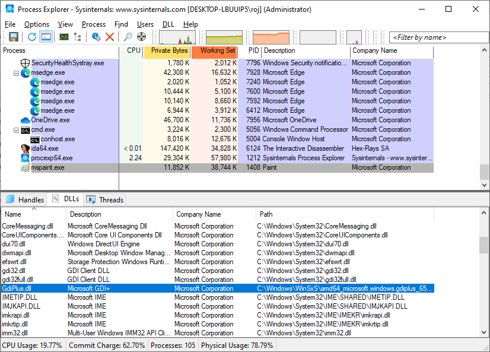
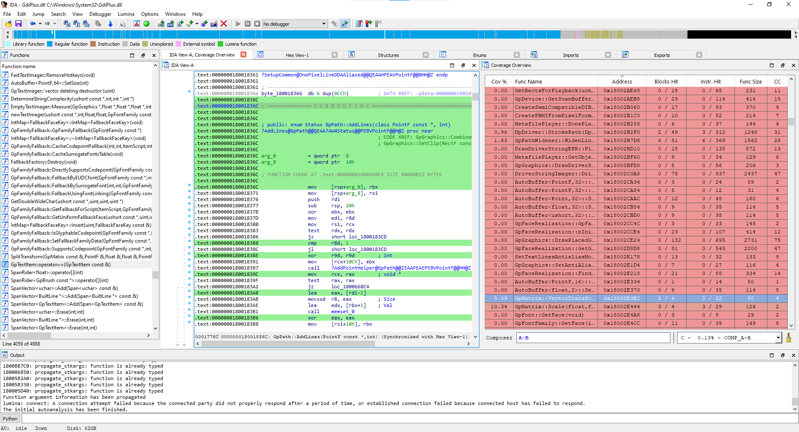
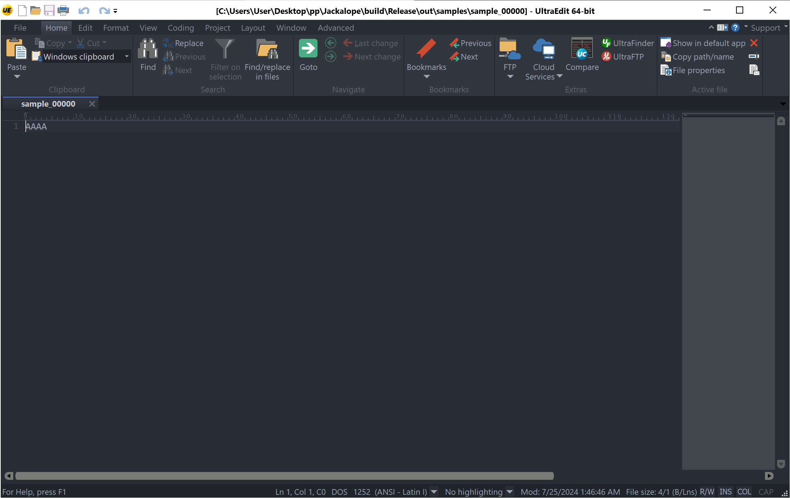
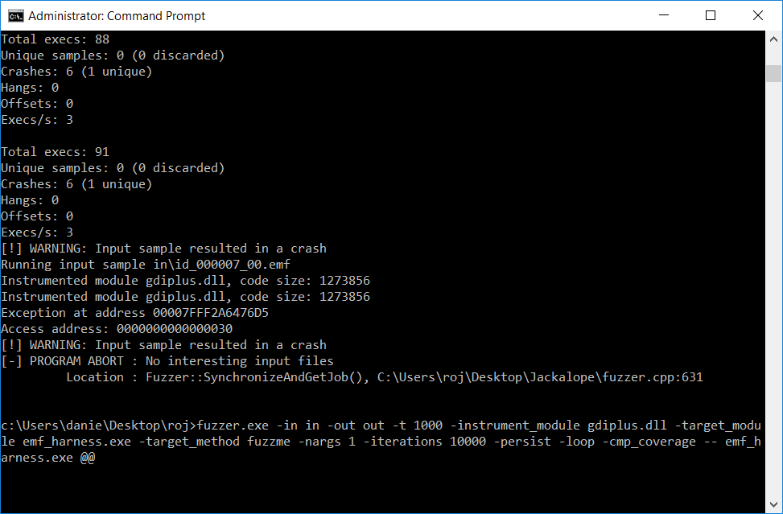
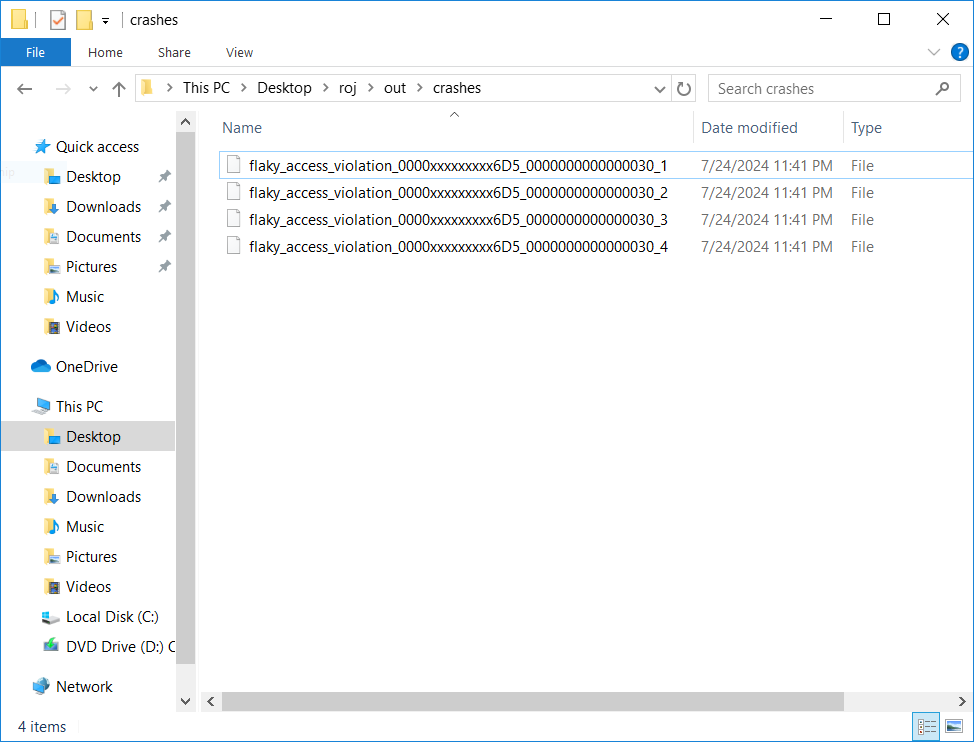

# EMF Fuzzing #1

> mspaint.exe → GdiPlus.dll


### Analysis

- DLL 파일 경로 확인
  - Sysinternals, Process Explorer 등의 tool로 어느 경로의 DLL을 사용하는 건지 꼭 확인해야 함




- Coverage 확인
  - litecov.exe로 실행되고 있는 프로세스의 GdiPlus.dll 파일 coverage 확인

```
litecov.exe -instrument_module GdiPlus.dll -coverage_file coverage.txt -trace_module_entries -pid 1408
```


- IDA - Lighthouse




- Dry run

  - coverage가 다른 sample을 10개 정도 생성해 dry run 실행

    

  - GdiPlus.dll 취약 버전 실행

    - DLL search order에 의해 fuzzer.exe가 위치한 디렉터리에 취약한 버전의 DLL 넣으면 우선적으로 실행됨

    	


<br>


### Reference

- [https://github.com/math1as/Windows-GDI-fuzzer/blob/master/emf_fuzz/emf_fuzz.cpp](https://github.com/math1as/Windows-GDI-fuzzer/blob/master/emf_fuzz/emf_fuzz.cpp)
