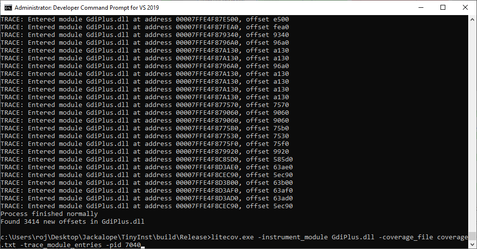

# EMF Fuzzing #1

> mspaint.exe → GdiPlus.dll


<br>


### Analysis

- DLL 파일 경로 확인
  - Sysinternals, Process Explorer 등의 tool로 어느 경로의 DLL을 사용하는 건지 꼭 확인해야 함


<br>

- Coverage 확인

  - litecov.exe로 실행되고 있는 프로세스의 GdiPlus.dll 파일 coverage 확인

    ```
    litecov.exe -instrument_module GdiPlus.dll -coverage_file coverage.txt -trace_module_entries -pid 1408
    ```

    

  - IDA - Lighthouse

    

<br>

- sample 생성

  ```
  // Emf Plus Record
  
  - EmfPlusHeader = 0x4001 // EMF+ 'header' data
  - EmfPlusEndOfFile = 0x4002 // EMF+ 'end of file' data
  - EmfPlusComment = 0x4003 // EMF+ 'comment' data
  - EmfPlusGetDC = 0x4004 // EMF+ 'get DC' data
  - These records are reserved and MUST NOT be used
    - EmfPlusMultiFormatStart = 0x4005 // EMF+ 'multi format start' data
    - EmfPlusMultiFormatSection = 0x4006 // EMF+ 'multi format section' data
    - EmfPlusMultiFormatEnd = 0x4007 // EMF+ 'multi format end' data
  - EmfPlusObject = 0x4008 // EMF+ 'object' data
  - EmfPlusClear  = 0x4009 // EMF+ 'clear' data
  - EmfPlusFillRects = 0x400A // EMF+ 'fill rectangles' data.
  - EmfPlusDrawRects = 0x400B // EMF+ 'draw rectangles' data
  - EmfPlusFillPolygon = 0x400C // EMF+ 'fill polygon' data
  - EmfPlusDrawLines = 0x400D // EMF+ 'draw lines' data
  - EmfPlusFillEllipse = 0x400E // EMF+ 'fill ellipse' data
  - EmfPlusDrawEllipse = 0x400F // EMF+ 'draw ellipse' data
  - EmfPlusFillPie = 0x4010 // EMF+ 'fill pie' data.
  - EmfPlusDrawPie = 0x4011 // EMF+ 'draw pie' data
  - EmfPlusDrawArc = 0x4012 // EMF+ 'draw arc' data
  - EmfPlusFillRegion = 0x4013 // EMF+ 'fill region' data
  - EmfPlusFillPath = 0x4014 // EMF+ 'fill path' data
  - EmfPlusDrawPath = 0x4015 // EMF+ 'draw path' data
  - EmfPlusFillClosedCurve = 0x4016 // EMF+ 'fill closed curve' data
  - EmfPlusDrawClosedCurve = 0x4017 // EMF+ 'draw closed curve' data
  - EmfPlusDrawCurve = 0x4018 //  EMF+ 'draw curve' data
  - EmfPlusDrawBeziers = 0x4019 // EMF+ 'draw beziers' data
  - EmfPlusDrawImage = 0x401A // EMF+ 'draw image' data
  - EmfPlusDrawImagePoints = 0x401B // EMF+ 'draw image points' data
  - EmfPlusDrawString = 0x401C // EMF+ 'draw string' data
  - EmfPlusSetRenderingOrigin = 0x401D // EMF+ 'set render origin' data
  - EmfPlusSetAntiAliasMode = 0x401E // EMF+ 'set anti alias mode' data
  - EmfPlusSetTextRenderingHint = 0x401F // EMF+ 'set render hint' data
  - EmfPlusSetTextContrast  = 0x4020 // EMF+ 'set text contrast' data
  - EmfPlusSetInterpolationMode = 0x4021 // EMF+ 'set interpolation mode' data
  - EmfPlusSetPixelOffsetMode = 0x4022 // EMF+ 'set pixel offset mode' data
  - EmfPlusSetCompositingMode = 0x4023 // EMF+ 'set compositing mode' data
  - EmfPlusSetCompositingQuality = 0x4024 // EMF+ 'set compositing quality' data
  - EmfPlusSave = 0x4025 // EMF+ 'save' data
  - EmfPlusRestore = 0x4026 // EMF+ 'restore' data
  - EmfPlusBeginContainer = 0x4027 // EMF+ 'begin container' data
  - EmfPlusBeginContainerNoParams = 0x4028 // EMF+ 'begin container no parameters' data
  - EmfPlusEndContainer = 0x4029 // EMF+ 'end container' data
  - EmfPlusSetWorldTransform = 0x402A // EMF+ 'set world transform' data
  - EmfPlusResetWorldTransform = 0x402B // EMF+ 'reset world transform' data
  - EmfPlusMultiplyWorldTransform = 0x402C // EMF+ 'multiply world transform' data
  - EmfPlusTranslateWorldTransform = 0x402D // EMF+ 'translate world transform' data
  - EmfPlusScaleWorldTransform = 0x402E // EMF+ 'scale world transform' data
  - EmfPlusRotateWorldTransform = 0x402F // EMF+ 'rotate world transform' data
  - EmfPlusSetPageTransform = 0x4030 // EMF+ 'set page transform' data
  - EmfPlusResetClip = 0x4031 // EMF+ 'reset clip' data
  - EmfPlusSetClipRect = 0x4032 // EMF+ 'set clip rectangle' data
  - EmfPlusSetClipPath = 0x4033 // EMF+ 'set clip path' data
  - EmfPlusSetClipRegion = 0x4034 // EMF+ 'set clip rectangle' data
  - EmfPlusOffsetClip = 0x4035 // EMF+ 'offset clip' data
  - EmfPlusDrawDriverstring = 0x4036 // EMF+ 'draw driver string' data
  - EmfPlusStrokeFillPath = 0x4037 // EMF+ 'stroke fill path' data
  - EmfPlusSerializableObject = 0x4038 // EMF+ 'serialize object' data  
  - EmfPlusSetTSGraphics = 0x4039 // EMF+ 'set graphics for a terminal server' data
  - EmfPlusSetTSClip = 0x403A // EMF+ 'set clip for a terminal server' data
  ```

  - Emf Plus Parser로 비교해 가며 최대한 많은 record(EMR)를 거치도록 sample 생성

    

<br>

- Run

  - coverage가 다른 sample을 10개 정도 생성해 run

    

  - GdiPlus.dll 취약 버전 실행

    - DLL search order에 의해 fuzzer.exe가 위치한 디렉터리에 취약한 버전의 DLL 넣으면 우선적으로 실행됨

    


<br>


### #1 Crash


​	→ `gdiplus!bGetNextRecord`

<br>

- PoC

  ```
  #include <stdio.h>
  #include <windows.h>
  #include <gdiplus.h>
  #include <shlwapi.h>
  #include <inttypes.h>
  #include <windows.h>
  #include <math.h>
  #include <strsafe.h>
  using namespace std;
  #pragma comment(lib, "Bcrypt")
  #include <winerror.h>
  #include <bcrypt.h>
  #pragma comment(lib, "msimg32.lib")
  #pragma comment(lib, "Gdiplus.lib")
  #pragma comment(lib, "shlwapi.lib")
  #include <gdiplusheaders.h>
  using namespace Gdiplus;
  
  int main(int argc, char* argv[])
  {
  	GdiplusStartupInput gdiplusStartupInput;
  	GdiplusStartupOutput gdiplusStartupOutput;
  	ULONG_PTR gdiplusToken = 0;
  
  	GdiplusStartup(&gdiplusToken, &gdiplusStartupInput, &gdiplusStartupOutput);
  
  	HENHMETAFILE hEmf = GetEnhMetaFileW(L"PoC.emf");
  	Metafile::EmfToWmfBits(hEmf, 0, NULL, MM_TEXT, EmfToWmfBitsFlagsDefault);
  
  	DeleteEnhMetaFile(hEmf);
  
  	GdiplusShutdown(gdiplusToken);
  
  	return 0;
  }
  ```

<br>

### Reference

- [https://github.com/math1as/Windows-GDI-fuzzer](https://github.com/math1as/Windows-GDI-fuzzer)
- [https://www.codeproject.com/Articles/1307140/Parse-understand-and-demystify-Enhanced-Meta-Files](https://www.codeproject.com/Articles/1307140/Parse-understand-and-demystify-Enhanced-Meta-Files)
- [https://learn.microsoft.com/en-us/openspecs/windows_protocols/ms-emf/05940d07-e112-4146-ac05-88fc6a1f70b9](https://learn.microsoft.com/en-us/openspecs/windows_protocols/ms-emf/05940d07-e112-4146-ac05-88fc6a1f70b9)
- [https://learn.microsoft.com/en-us/openspecs/windows_protocols/ms-emfplus/5df4ef02-3895-41a3-aa0e-a8f4b8b31e4e](https://learn.microsoft.com/en-us/openspecs/windows_protocols/ms-emfplus/5df4ef02-3895-41a3-aa0e-a8f4b8b31e4e
- [https://www.seljan.hu/posts/null-pointer-dereference-in-windows-gdi-bparsewin32metafile/](https://www.seljan.hu/posts/null-pointer-dereference-in-windows-gdi-bparsewin32metafile/)

- [https://www.seljan.hu/posts/out-of-bounds-read-information-disclosure-vulnerability-in-microsoft-windows-gdi-emr_setdibitstodevice-record/](https://www.seljan.hu/posts/out-of-bounds-read-information-disclosure-vulnerability-in-microsoft-windows-gdi-emr_setdibitstodevice-record/)
- [https://rond-o.tistory.com/214](https://rond-o.tistory.com/214)
